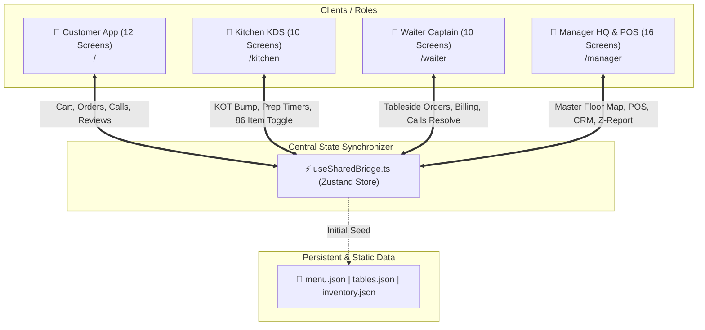

# 🏛️ Thoogudeepa Donne Biryani Suite - System Architecture

This document details the architectural design, reactive state flow, data contracts, and cross-portal synchronization mechanisms implemented across the 4 restaurant operating portals.

---

## 1. High-Level System Design



---

## 2. Shared State Bridge (`useSharedBridge.ts`)

Rather than having isolated islands of state, this application utilizes a single **Reactive Bridge Store** (`customer-next/store/useSharedBridge.ts`) that exposes granular actions and selectors:

### Core Data State:
- `tables`: Array of all restaurant tables (Number, Capacity, Status: Available / Occupied / Billed, Running Total, Active Guests).
- `kdsTickets`: Array of live Kitchen Order Tickets (Ticket ID, Table Number, Items, Special Notes, Status: QUEUED / PREPARING / READY / COMPLETED, Timestamp).
- `pings`: Array of customer-to-waiter assistance requests (Ping ID, Table Number, Type: WATER / WAITER / BILL / CLEAN, Status: PENDING / ACCEPTED / RESOLVED, Timestamp).
- `inventory86`: Record of dishes and ingredients marked unavailable/sold-out (`{ [dishId: string]: boolean }`).
- `shiftStats`: Running daily metrics (Total Sales, Order Count, Cash Collected, UPI Collected, Card Collected, Tips, Avg Prep Time).

### Inter-Portal Reactive Triggers:
1. **Customer Places Order**:
   - Customer clicks "Confirm Order" on `Screen4Cart`.
   - Action `customerPlacesOrder(tableNumber, items, notes)` executes.
   - Bridge assigns a sequential KOT Ticket #, adds it to `kdsTickets`, sets Table status to `OCCUPIED`, and increments running bill.
   - Kitchen KDS displays the new ticket with audio chime.
   - Manager Floor Map updates Table to amber/occupied.
2. **Kitchen 86 Item Sold Out**:
   - Chef taps "86 Item" on `ScreenK4Inventory86`.
   - Action `toggle86Item(dishId, boolean)` fires.
   - Customer Menu (`Screen2Menu`) instantly renders "Sold Out" badges and disables selection.
   - Waiter POS (`ScreenW4TakeOrder`) warns "Item 86'd" if captain attempts to punch it.
   - Manager Menu Master (`ScreenM5Menu`) shows item status as offline.
3. **Customer Calls Waiter**:
   - Customer taps "Request Water" on `Screen10WaiterCall`.
   - Action `customerPingsWaiter(tableNumber, 'WATER')` fires.
   - Waiter Table Feed (`ScreenW2TablesFeed`) displays an amber call banner with quick "Accept / Clear" button.
4. **Waiter / Manager Settles Bill**:
   - Payment recorded via UPI or Cash.
   - Action `waiterRecordsPayment(tableNumber, method, amount)` fires.
   - Bridge adds payment to `shiftStats`, updates Table status to `AVAILABLE`, clears running items, and updates Manager Z-Report ledger.

---

## 3. Technology Stack & Decision Matrix

| Technology | Selection Rationale |
| :--- | :--- |
| **Next.js 15 (App Router)** | Modern SSR/SSG framework providing lightning-fast route transitions between `/`, `/kitchen`, `/waiter`, and `/manager`. |
| **React 19** | Latest React primitives, high-performance rendering, and hook optimizations. |
| **Zustand 5** | Lightweight, zero-boilerplate client state management without Redux overhead; perfect for real-time bridge synchronization. |
| **Tailwind CSS 3.4** | Utility-first styling with custom mobile viewport containers (`max-w-[430px]`) for phone apps and responsive grids for desktop/tablet screens. |
| **Framer Motion 13** | Smooth 60fps micro-interactions, swipeable sheets, drawer animations, and ticket transitions. |
| **Lucide React** | Consistent, modern icon set across all 48 screens. |

---

## 4. Directory Structure & Key Files

```
customer-next/
├── app/
│   ├── page.tsx                    # Customer Portal (12 screens)
│   ├── kitchen/page.tsx            # Kitchen KDS Portal (10 screens)
│   ├── waiter/page.tsx             # Waiter Suite (10 screens)
│   └── manager/page.tsx            # Manager Command Center (16 screens)
├── components/
│   ├── screens/Screen1Splash.tsx ... Screen12Feedback.tsx
│   ├── kitchen/ScreenK1Login.tsx ... ScreenK10AuditLog.tsx
│   ├── waiter/ScreenW1Login.tsx ... ScreenW10ShiftStats.tsx
│   │   └── tablet/TabletScreen1Login.tsx ... TabletScreen10ShiftStats.tsx
│   ├── manager/ScreenM1Login.tsx ... ScreenM16DayCloseZReport.tsx
│   └── ui/                         # Badges, drawers, sheets, modals
└── store/
    └── useSharedBridge.ts          # Reactive sync core
```

---

## 5. Security, Resilience & Offline-Ready Architecture

1. **Role-Based Isolation**: Each portal has PIN-based role gates (Manager PIN `9999`, Kitchen PIN `1234`, Waiter PIN `1001`).
2. **Deterministic Fallbacks**: If external networks fail, local Zustand state continues functioning in-memory.
3. **Standard ESC/POS Printing**: Thermal receipts conform to standard 80mm ESC/POS layout for direct plug-and-play with hardware printers (Epson, TVS, Star Micronics).
